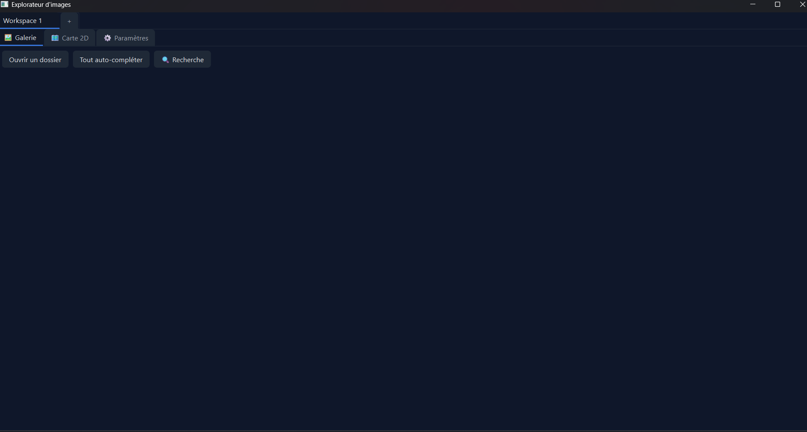
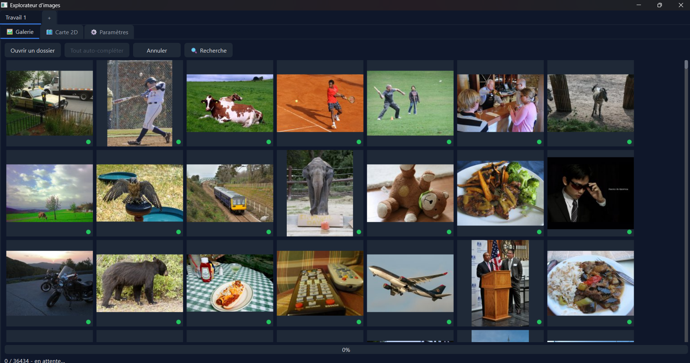
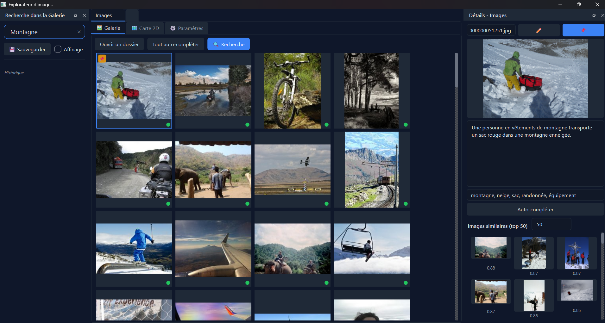
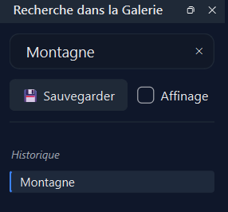
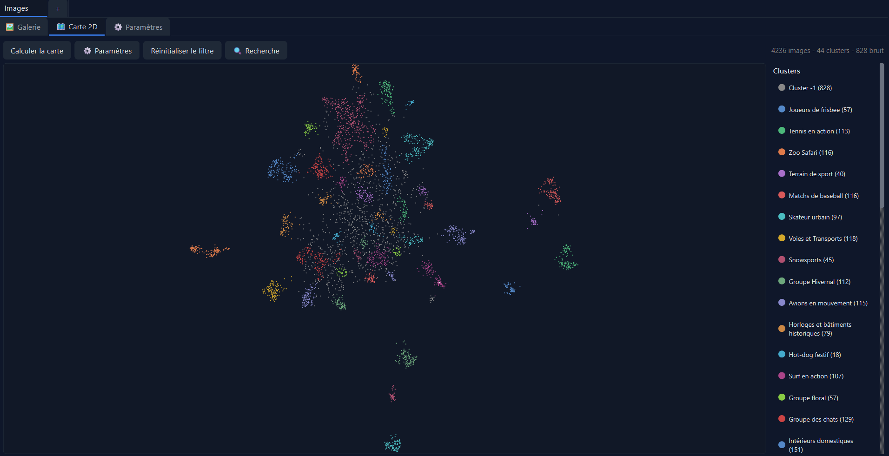
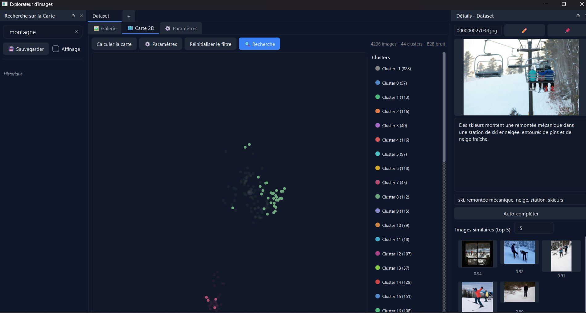
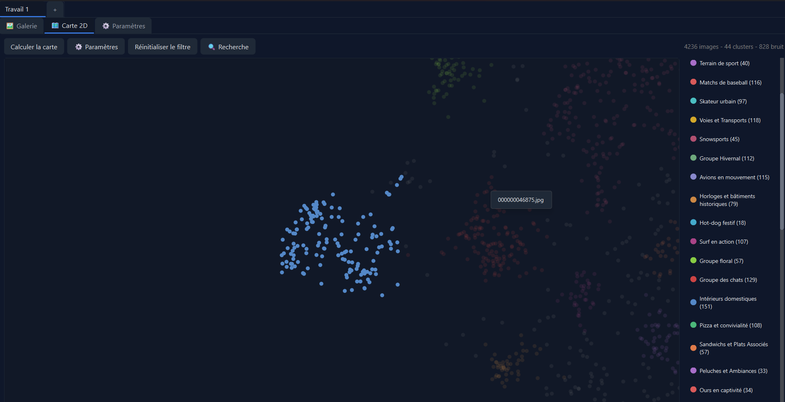
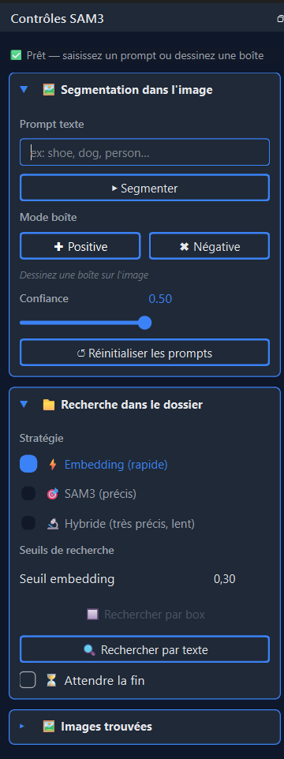
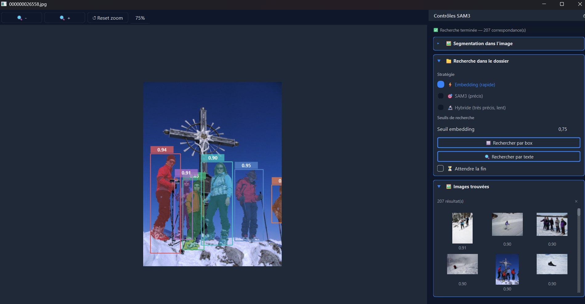

# Guide de démonstration — Explorateur Image Sémantique

> **Contexte :** Vous êtes photographe. Votre disque dur contient 41 000 images non classées, sans noms significatifs. Vous devez retrouver une photo précise  puis trouver toutes les images visuellement et sémantiquement proches.

---

## 1. Ouvrir un corpus d'images

Au lancement de l'application, vous disposez d'un espace de travail vide (un *workspace*). Cliquez sur **Ouvrir un dossier** pour sélectionner le répertoire contenant vos images.

Vos images s'affichent immédiatement sous forme de miniatures dans la galerie.

🔧 Détail technique — Affichage des miniatures

L'application génère des thumbnails à la volée et les met en cache à deux niveaux : un cache mémoire LRU (600 entrées) et un cache disque JPEG dans `.thumbnails/`. Seules les images visibles à l'écran sont chargées (prefetch de 3 lignes), ce qui permet d'afficher des milliers d'images sans saturer la mémoire.

---

## 2. Indexer les images — l'auto-complétion

Pour pouvoir rechercher par contenu, chaque image doit être **indexée** : l'application lui associe une description textuelle, des mots-clés et un vecteur sémantique (embedding).

Cliquez sur **Tout auto-compléter** pour lancer l'analyse en lot.

Une barre de progression indique l'avancement. Vous pouvez annuler à tout moment via le bouton **Annuler**.

Les images déjà indexées sont signalées par une **pastille verte** dans le coin de leur miniature — elles ne seront pas réanalysées.

🔧 Détail technique — Pipeline d'indexation

Pour chaque image, l'application appelle **Qwen2.5-VL** (modèle vision-langage via Ollama) avec un prompt structuré qui demande une description en 2 à 4 phrases et exactement 5 mots-clés. Le texte obtenu est ensuite envoyé au modèle **nomic-embed-text** pour produire un vecteur de 768 dimensions. L'ensemble (description, mots-clés, embedding) est sauvegardé dans un fichier `index.json` local au dossier — il n'y a donc aucun recalcul au prochain démarrage.

---

## 3. Consulter le détail d'une image

Cliquez sur n'importe quelle miniature pour ouvrir le **panneau de détail** à droite.

Ce panneau affiche :

- un aperçu agrandi de l'image
- la description générée automatiquement
- les mots-clés associés
- les **images similaires** (voisins sémantiques les plus proches)

Vous pouvez modifier la description et les mots-clés manuellement, ou lancer **Auto-compléter** sur cette seule image pour les générer.

🔧 Détail technique — Calcul des voisins

Les k voisins sont calculés par **similarité cosinus** entre l'embedding de l'image sélectionnée et ceux de toutes les images indexées. Le nombre k est réglable via le compteur dans le panneau. Le calcul est effectué à la sélection..

---

## 4. Rechercher une image par son contenu

C'est ici que l'application prend tout son sens. Ouvrez le **panneau de recherche** via le bouton **🔍 Recherche**, puis tapez une description en français.

Par exemple : `montagne`

Les images les plus proches sémantiquement de votre requête remontent en tête. La recherche fonctionne même si les mots exacts ne figurent pas dans les métadonnées — elle compare les sens.

Essayez aussi une phrase complète : `Montagne avec une croix et des personnes`

🔧 Détail technique — Recherche sémantique

La requête est convertie en embedding par **nomic-embed-text**, puis comparée à tous les embeddings de l'index par similarité cosinus. Un bonus de score est accordé si le texte de la requête apparaît littéralement dans la description ou les mots-clés (`+0.3`), et un bonus supplémentaire si la similarité cosinus dépasse 0.5 ET qu'il y a correspondance textuelle (`+0.5`). Les 100 meilleurs résultats sont retournés.

---

## 5. Sauvegarder et affiner les recherches

### Épingler des images importantes

Si une image vous intéresse, **épinglez-la** via l'icône 📌 dans le panneau de détail (ou `Ctrl+E`). Les images épinglées apparaissent toujours en tête de galerie, quelle que soit la recherche en cours.

### Sauvegarder une recherche

Cliquez sur **💾 Sauvegarder** pour mémoriser la recherche courante dans l'**historique**.

L'historique prend la forme d'un arbre : chaque recherche sauvegardée devient un nœud. Cliquer sur un nœud restaure instantanément les résultats correspondants.

### Affiner une recherche

Activez la case **Affinage** pour que la prochaine recherche s'effectue *à l'intérieur* des résultats actuels. Cela permet d'affiner progressivement :

1. `montagne` → sauvegardez
2. Activez **Affinage** → tapez `personnes` → sauvegardez
3. Activez **Affinage** → tapez `croix` → sauvegardez

Vous naviguez entre les branches de l'arbre pour comparer les résultats.

🔧 Détail technique — Arbre de recherche

L'historique est implémenté comme un arbre d'objets `SearchNode`, chacun portant la requête et la liste des noms d'images résultantes. Cet arbre est sérialisé dans `config.json` (clé `history_search`) et restauré à l'ouverture du workspace. L'affinage utilise la liste de résultats du nœud courant comme contexte de la prochaine recherche (paramètre `context` de `filtered_images`).

---

## 6. Visualiser la carte sémantique 2D

Passez à l'onglet **🗺 Carte 2D** pour voir l'ensemble du corpus organisé spatialement.

Chaque point représente une image. Les points proches sont sémantiquement similaires. Les couleurs indiquent les **clusters** (groupes thématiques) détectés automatiquement, nommés par l'IA en 2 à 3 mots.

Cliquez sur un cluster dans la légende pour l'isoler et zoomer dessus. Cliquez sur un point pour sélectionner l'image correspondante (elle se surligne aussi dans la galerie).

La barre de recherche fonctionne également sur la carte : les points correspondants se mettent en valeur, les autres s'estompent.

🔧 Détail technique — UMAP + HDBSCAN

Les embeddings de 768 dimensions sont réduits à 2 dimensions via **UMAP** (`n_neighbors=30`, `min_dist=0.3`, métrique cosinus). Les clusters sont ensuite détectés par **HDBSCAN** (`min_cluster_size=15`). Chaque cluster est nommé par un appel à `qwen2.5vl:7b` sur un échantillon aléatoire de 8 descriptions. La carte est mise en cache dans `.semantic_map/map_cache.pkl` pour éviter les recalculs. Les paramètres sont modifiables dans le dock **⚙️ Paramètres** (accessible depuis l'onglet Carte 2D).

---

## 7. Trouver les images similaires visuellement — SAM3

Vous avez retrouvé l'image cible. Maintenant, vous voulez toutes les images qui contiennent la même scène ou les mêmes éléments visuels.

Faites un **clic droit** sur l'image dans la galerie (ou cliquez sur son aperçu dans le panneau de détail) pour ouvrir la fenêtre **SAM3**.

### Segmentation dans l'image

Avant de lancer la recherche, vous pouvez explorer l'image :

- **Prompt texte (en anglais)** : tapez `person` ou `cross` pour localiser les objets (le modèle surligne les zones détectées avec des masques colorés).
- **Boîte dessinée** : tracez un rectangle autour d'un objet avec la souris.

Le curseur de **Confiance** contrôle le seuil de détection : plus il est bas, plus de zones sont surlignées (y compris des faux positifs).

### Recherche dans tout le dossier

C'est la fonctionnalité la plus puissante. Dans la section **📁 Recherche dans le dossier**, trois stratégies sont disponibles :

| Stratégie | Vitesse | Précision | Fonctionne sur |
|---|---|---|---|
| ⚡ Embedding | Rapide | Sémantique | Images indexées |
| 🎯 SAM3 | Lent | Visuel | Tout le dossier |
| 🔬 Hybride | Lent | Très précis | Images indexées |

**Pour une première recherche**, utilisez **Embedding** : dessinez une boîte autour de la zone d'intérêt, puis cliquez **🔲 Rechercher par box**.

**Pour affiner**, utilisez **Hybride** : l'embedding présélectionne les candidats, SAM3 valide visuellement chaque image.

Les résultats s'affichent sous forme de miniatures avec leur score. Cliquez sur une miniature pour l'ouvrir dans SAM3 et enchaîner les recherches.

🔧 Détail technique — Stratégies de recherche

**Embedding** : le contenu de la boîte est décrit par Qwen2.5-VL en français, puis converti en embedding. La similarité cosinus est calculée sur l'index.

**SAM3** : Qwen2.5-VL nomme l'objet en 1-2 mots anglais. SAM3 analyse ensuite chaque image du dossier avec ce prompt texte. Score = meilleur score SAM3 obtenu.

**Hybride** : deux appels VLM (description FR pour l'embedding, nom EN pour SAM3). L'embedding présélectionne les candidats au-dessus du seuil. SAM3 valide chaque candidat. Score final = score_embedding × score_SAM3.

L'affichage des résultats est progressif (par lots de 50 via QTimer) pour ne jamais bloquer l'interface. La case **⏳ Attendre la fin** accumule tous les résultats avant de les afficher, triés par score décroissant.

---

## 8. Fonctionnalités complémentaires

### Multi-workspace

L'application supporte plusieurs espaces de travail indépendants, accessibles via les onglets en haut de fenêtre. Chaque workspace a son propre dossier, son historique de recherche, ses images épinglées et ses paramètres de carte. Utilisez `Ctrl+T` pour créer un nouveau workspace, `Ctrl+W` pour fermer, `Ctrl+Tab` pour naviguer.

### Renommage d'images

Dans le panneau de détail, modifiez le nom dans le champ titre et cliquez ✏️. Le fichier est renommé sur le disque, l'index est mis à jour, et le cache de miniatures est invalidé automatiquement.

### Personnalisation de l'interface

L'onglet **⚙️ Paramètres** permet de changer le thème visuel (3 thèmes prédéfinis : Bleu nuit, Noir minuit, Blanc givré) ou de personnaliser chaque couleur individuellement. Il permet également de changer la langue de l'interface (français / anglais).

